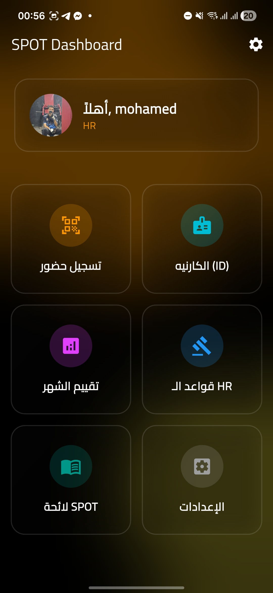
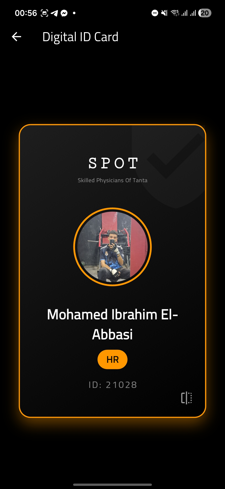
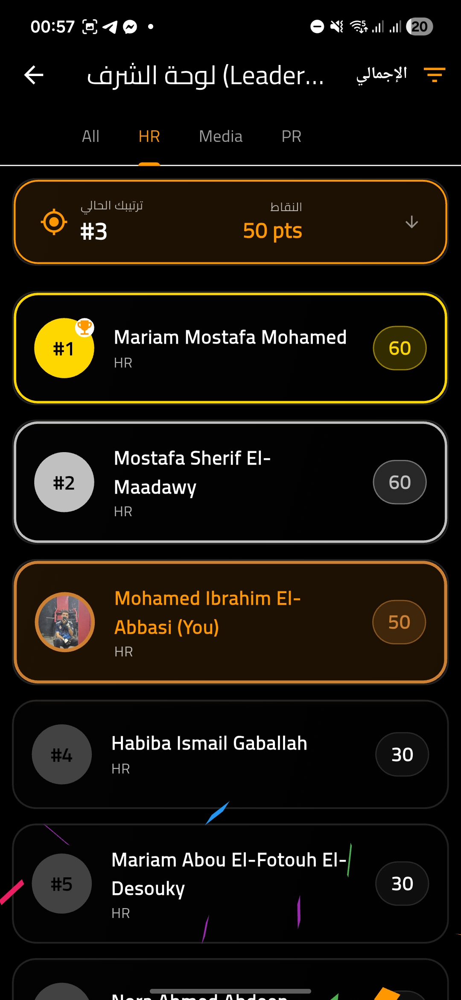
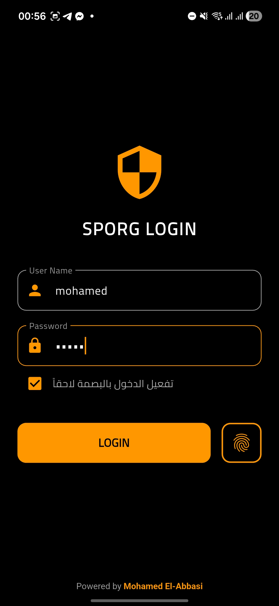
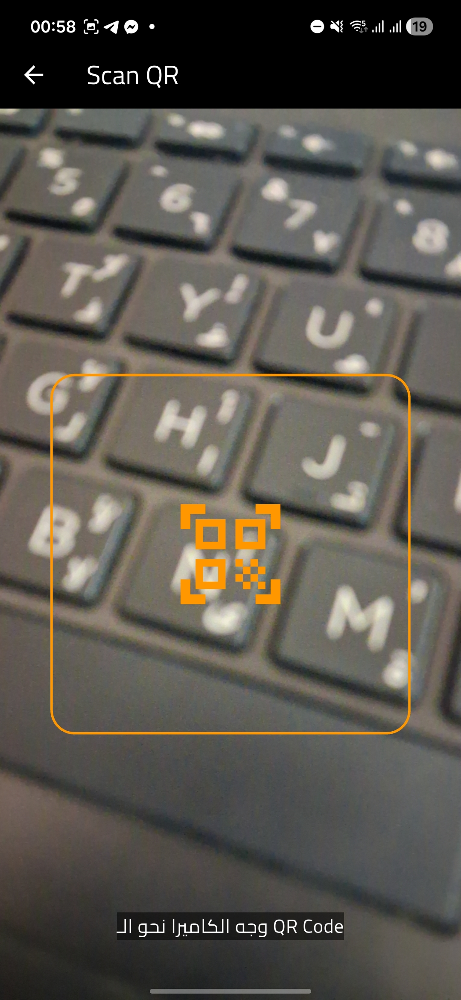
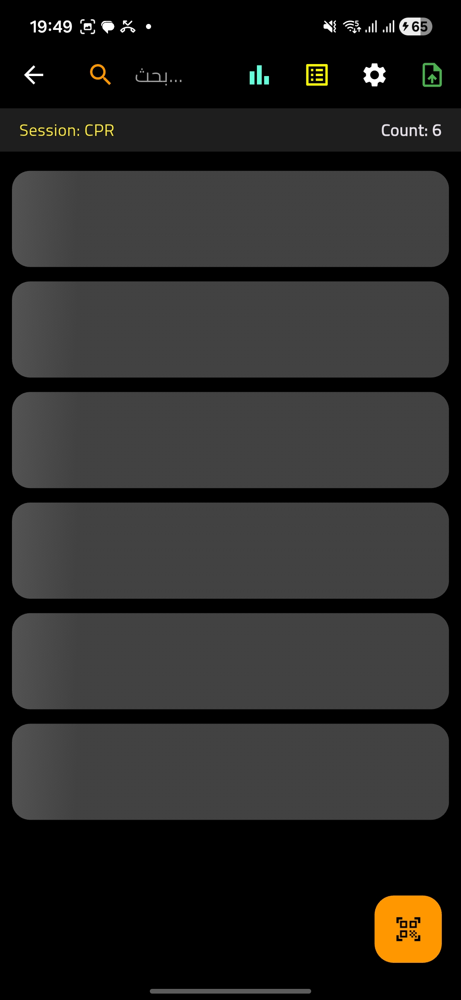

<div align="center">


# 🚀 SPORG - SPOT Organization App

**The Ultimate "Super App" for Skilled Physicians of Tanta (SPOT).** *Attendance Tracking • Gamified Leaderboards • Digital Identity • Analytics*

[](https://flutter.dev/)
[](https://dart.dev/)
[](https://firebase.google.com/)
[]()

</div>

---

## 📖 Overview

**SPORG** is not just an attendance app; it is a comprehensive **enterprise-grade mobile ecosystem** designed to digitize the operations of SPOT. Built with a focus on **Premium UI/UX**, it leverages modern design trends like **Glassmorphism** and **Micro-interactions** to provide a delightful experience for both Admins and Members.

---

## ✨ What makes it "Wow"? (New Features)

### 🎨 Premium UI/UX
- **Glassmorphism Design:** Modern, transparent glass-effect cards and headers using `BackdropFilter`.
- **Animated Mesh Background:** A soothing, continuously moving background with blended colors (Orange/Black/Yellow).
- **Lottie Animations:** High-quality vector animations for scanning, loading, and interactions.
- **Skeleton Loading:** Replaced boring spinners with "Shimmer" effects for a polished loading experience.

### 🆔 3D Digital ID Card
- **Flip Animation:** A realistic 3D card that flips on drag or tap.
- **Front:** Displays member photo, name, and team.
- **Back:** Generates a dynamic QR code for instant scanning.

### 🏆 Gamification & Leaderboard
- **Interactive Dashboard:** View monthly and total points rankings.
- **Celebration Effects:** **Confetti rains down** 🎊 automatically if the logged-in user is in the Top 3!
- **Smart Scrolling:** A "Your Rank" banner that auto-scrolls to the user's position in the list.

### 🔐 Enterprise Security
- **Biometric Login:** Secure and fast access using **Fingerprint** or **Face ID** (via `local_auth`).
- **Secure Session:** Encrypted storage of user credentials using `shared_preferences` with biometric fencing.

---

## 🌟 Core Features

### 📱 Attendance System
- **High-Speed QR Scanner:** Animated scanner frame powered by `mobile_scanner`.
- **Dynamic Roles:** Assign roles (Organizer, Trainer, Participant) on the fly.
- **Real-time Sync:** Instant updates to Firestore Database.

### 📊 Admin Dashboard
- **Points Management:** Upload CSV files to update member points in bulk.
- **Manual Edits:** Tap on any member in the leaderboard to adjust points manually.
- **Push Notifications:** Send global alerts via Firebase Cloud Messaging (FCM) with images.
- **Database Management:** Add, edit, or delete members directly from the app.

### 📂 Resources & Knowledge
- **PDF Library:** Access HR Rules, Evaluation Guidelines, and Certificates directly (via Google Drive integration).
- **Export:** One-click export of attendance reports to **CSV** for Excel analysis.

---

## 🛠️ Tech Stack

| Category | Technology / Package |
| :--- | :--- |
| **Framework** | Flutter (Dart) |
| **Backend** | Firebase Firestore |
| **Auth** | Local Auth (Biometrics), Firebase Firestore|
| **State Management** | Provider |
| **Animations** | Lottie, Confetti, Simple Animations |
| **UI Effects** | Shimmer, BackdropFilter (Glass) |
| **Tools** | Mobile Scanner, QR Flutter, CSV, URL Launcher |
| **Charts** | FL Chart |

---

## 📸 Screenshots

<div align="center">
  <table>
    <tr>
      <td align="center"><b>Glass Dashboard</b></td>
      <td align="center"><b>3D Digital ID</b></td>
      <td align="center"><b>Leaderboard (Confetti)</b></td>
    </tr>
    <tr>
      <td></td>
      <td></td>
      <td></td>
    </tr>
    <tr>
      <td align="center"><b>Biometric Login</b></td>
      <td align="center"><b>QR Scanner (Lottie)</b></td>
      <td align="center"><b>Skeleton Loading</b></td>
    </tr>
    <tr>
      <td></td>
      <td></td>
      <td></td>
    </tr>
  </table>
</div>


---

## 🚀 Getting Started

### Prerequisites
* Flutter SDK (`>=3.0.0`)
* Android Studio / VS Code
* Firebase Project Setup

### Installation

1.  **Clone the repository:**
    ```bash
    git clone [https://github.com/melabbasi/SPORG.git](https://github.com/melabbasi/SPORG.git)
    cd sporg
    ```

2.  **Install dependencies:**
    ```bash
    flutter pub get
    ```

3.  **Configuration:**
    * Add your `google-services.json` to `android/app/`.
    * Ensure `AndroidManifest.xml` has Biometric permissions.
    * Update the `Service Account Key` in `AppProvider` (for Notifications).

4.  **Run the app:**
    ```bash
    flutter run
    ```

---

## 👨‍💻 Developer

<div align="center">

### **Mohamed El-Abbasi**

🎓 **Medical Student** @ Tanta University (Batch 68)  
💻 **Moderator**, Computer Team @ SPOT  
👔 **Moderator**, HR Team @ SPOT

*Passionate about merging Medicine with Technology.*

[Facebook]((https://www.facebook.com/mohamedibrahim.elabbasi)) • [GitHub](https://github.com/melabbasi)

Made with ❤️ for **SPOT Family**

</div>
